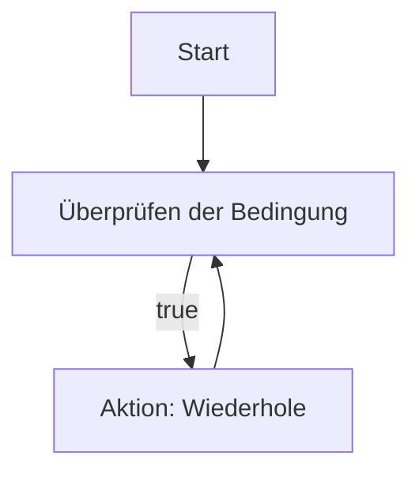
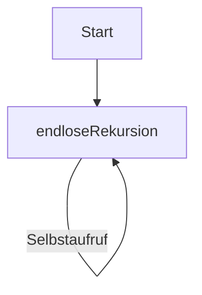

# 03 Grundlegende Prinzipien der Programmentwicklung
## 03–Verständnisfragen zur selbstständigen Beantwortung
### (1) Nenne die drei Programmprinzipien.
> Modularität, Abstraktion, Verbesserung & Polymorphismus
### (2) Lassen sich alle Schleifentypen ineinander überführen? Wenn ja, warum brauchen wir die unterschiedlichen Varianten überhaupt?
> for-, while- und do-while-Schleifen (unterschiedliche Vorteile)
### (3) Ist das Einrücken von Programmcode eine sinnvolle Sache?
> Für bessere Lesbarkeit & Struktur
### (4) Warum ist die Auslagerung von Funktionen sinnvoll?
> Wiederverwendbarkeit / bessere Wartbarkeit
## 03–Aufgabensammlung
### (1) Versuchen Sie ihr Lieblingsrezept in Pseudocode zu notieren und anschließend in ein Aktivitätsdiagramm zu übertragen.
```
BEGIN   Eierkuchen
        EIER in eine SCHÜSSEL geben
        RÜHREN (EIER)
        MEHL hinzufügen
        MILCH hinzufügen, bis die Mischung glatt ist
        ÖL in einer PFANNE erhitzen
        TEIG in die Pfanne geben
        PFANNKUCHEN von beiden Seiten braten
        SERVIEREN
END     Eierkuchen
```
### (2) Überlegen Sie sich Fälle, bei denen ein Programm nicht terminiert. Verwenden Sie für die Erläuterung ebenfalls Aktivitätsdiagramme.
> `while(true)` & Endlose Rekursion



### (3) Gehen Sie die einzelnen Schritte aus Abschnitt 2.3.2 durch und bringen Sie das Programm ProgrammEins zum Laufen:
```java
 public class ProgramEins {
    public static void main(String[] args) {
        System.out.println("Endlich ist es soweit! Mein erstes Programm läuft...");
    }
}
 ```

### (4) Geben Sie ein Programm in Java an, das folgende Formeln in jeweils separaten Funktionen berechnet
> a) $`f1(x) = x`$ \
> b) $`f2(x) = \frac{x^2}{2}+17*2 `$ \
> c) $`f2(x) = \frac{(x −1)^3−14)}{2}`$
```java
public class Main {
    public static void main(String[] args) {
        progPrakBeispiele bsp = new progPrakBeispiele();
        bsp.formelf1x(5); // implementiert für int & flaot 
        bsp.formelf2x(5); // implementiert für int & flaot 
        bsp.formelf3x(5); // implementiert für int & flaot 
    }
}
```
> [!NOTE]
> [Klicke hier um den code in der Klasse progPrakBeispiele zu sehen](../src/progPrakBeispiele.java#L17-L36)

### (5) Schreiben Sie ein Programm, das für i=1,2,...,20 die Fakultätsfunktion berechnet und die Funktionswerte zeilenweise ausgibt. Die Fakultätsfunktion ist wie folgt definiert
> $` fakultaet(n) = 1 * 2 \dots n =  \prod_{i=1}^{n} n! `$
```java
public class Main {
    public static void main(String[] args) {
        progPrakBeispiele bsp = new progPrakBeispiele();
        int input = 15, input2 = 20;
        int erg = bsp.fakultaet(input);
        System.out.println(erg);

        erg = bsp.fakultaet(input2);  // Überschreitet Integer.MAX_VALUE // int - 32 Bit(4Bytes)
        System.out.println(erg);
    }
}
```
> [!NOTE]
> [Klicke hier um den code in der Klasse progPrakBeispiele zu sehen](../src/progPrakBeispiele.java#L38-L50)

### (6) Geben Sie für die folgenden Summen entsprechende for-Schleifen an:
> a) $` \sum_{i=0}^{28}(i-1)^2 `$\
> b) $` \sum_{i=0}^{100}\frac{i*(i+1)}{2} `$\
> c) $` \sum_{i=1}^{25}\frac{i+1}{i} `$
```java
public class Main {
    public static void main(String[] args) {
        progPrakBeispiele bsp = new progPrakBeispiele();
        System.out.println(bsp.summenForLoopA());
        System.out.println(bsp.summenForLoopB());
        System.out.println(bsp.summenForLoopC());
    }
}
```
> [!NOTE]
> [Klicke hier um den code in der Klasse progPrakBeispiele zu sehen](../src/progPrakBeispiele.java#L52-L72)