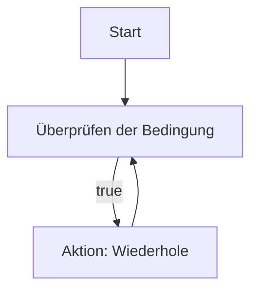
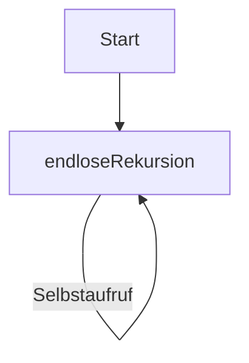

# 03 Grundlegende Prinzipien der Programmentwicklung
## 03–Verständnisfragen zur selbstständigen Beantwortung
### (1) Nenne die drei Programmprinzipien.
> Modularität, Abstraktion, Verbesserung & Polymorphismus
### (2) Lassen sich alle Schleifentypen ineinander überführen? Wenn ja, warum brauchen wir die unterschiedlichen Varianten überhaupt?
> for-, while- und do-while-Schleifen (unterschiedliche Vorteile)
### (3) Ist das Einrücken von Programmcode eine sinnvolle Sache?
> Für bessere Lesbarkeit & Struktur
### (4) Warum ist die Auslagerung von Funktionen sinnvoll?
> Wiederverwendbarkeit / bessere Wartbarkeit
## 03–Aufgabensammlung
### (1) Versuchen Sie ihr Lieblingsrezept in Pseudocode zu notieren und anschließend in ein Aktivitätsdiagramm zu übertragen.
```
BEGIN   Eierkuchen
        EIER in eine SCHÜSSEL geben
        RÜHREN (EIER)
        MEHL hinzufügen
        MILCH hinzufügen, bis die Mischung glatt ist
        ÖL in einer PFANNE erhitzen
        TEIG in die Pfanne geben
        PFANNKUCHEN von beiden Seiten braten
        SERVIEREN
END     Eierkuchen
```
### (2) Überlegen Sie sich Fälle, bei denen ein Programm nicht terminiert. Verwenden Sie für die Erläuterung ebenfalls Aktivitätsdiagramme.
> `while(true)` & Endlose Rekursion



### (3) Gehen Sie die einzelnen Schritte aus Abschnitt 2.3.2 durch und bringen Sie das Programm ProgrammEins zum Laufen:
```java
 public class ProgramEins {
    public static void main(String[] args) {
        System.out.println("Endlich ist es soweit! Mein erstes Programm läuft...");
    }
}
 ```

### (4) Geben Sie ein Programm in Java an, das folgende Formeln in jeweils separaten Funktionen berechnet
> a) $`f1(x) = x`$ \
> b) $`f2(x) = \frac{x^2}{2}+17*2 `$ \
> c) $`f2(x) = \frac{(x −1)^3−14)}{2}`$
```java
public class L3Formeln {
    public static void main(String[] args) {
        L3JavaCode.L3Formeln formeln = new L3JavaCode.L3Formeln();
        System.out.println(formeln.formelf1x(5)); // implementiert für int & flaot 
        System.out.println(formeln.formelf2x(5)); // implementiert für int & flaot 
        System.out.println(formeln.formelf3x(5)); // implementiert für int & flaot 
    }
}
```
> [!NOTE]
> [Klicke hier um den code in der Klasse L3Formeln zu sehen](../src/L3JavaCode/L3Formeln.java)

### (5) Schreiben Sie ein Programm, das für i=1,2,...,20 die Fakultätsfunktion berechnet und die Funktionswerte zeilenweise ausgibt. Die Fakultätsfunktion ist wie folgt definiert
> $` fakultaet(n) = 1 * 2 \dots n =  \prod_{i=1}^{n} n! `$
```java
public class L3Fak {
    public static int fakultaet(int input){
        if (input < 0) {
            throw new IllegalArgumentException("Die Zahl muss nicht negativ sein.");
        }
        if(input > 19){
            throw new IllegalArgumentException("Die Zahl darf nicht größer als 19 sein.");
        }
        if (input == 0 || input == 1) {
            return 1; // Basisfall: 0! und 1! sind 1
        }
        return input * fakultaet(input - 1);

    }

    public static void main(String[] args) {
        System.out.println(fakultaet(15));
    }
}
```
> [!NOTE]
> [Klicke hier um den code in der Klasse L3Fak zu sehen](../src/L3JavaCode/L3Fak.java)

### (6) Geben Sie für die folgenden Summen entsprechende for-Schleifen an:
> a) $` \sum_{i=0}^{28}(i-1)^2 `$\
> b) $` \sum_{i=0}^{100}\frac{i*(i+1)}{2} `$\
> c) $` \sum_{i=1}^{25}\frac{i+1}{i} `$
```java
public class L3Loops {
    public static void main(String[] args) {
        System.out.println(summenForLoopA());
        System.out.println(summenForLoopB());
        System.out.println(summenForLoopC());
    }
}
```
> [!NOTE]
> [Klicke hier um den code in der Klasse L3JavaCode.L3Loops zu sehen](../src/L3JavaCode/L3Loops.java)

### (7) Überführen Sie die folgenden Schleifen in for- bzw. while-Schleifen
| For-Schleife                                                                   | For-Schleife2                               | While-Schleife                                                 |
|--------------------------------------------------------------------------------|---------------------------------------------|----------------------------------------------------------------|
| for (int x=7; x<12; x++) for (int y=0; x=10; x>y; y++, x--) <br/>`<Anweisung>` | for (int x=7; x<12; x++) <br/>`<Anweisung>` | int a = 1024;<br>while (a>2) { <br/> <Anweisung> a=a/2; <br/>} |

```java
import L3JavaCode.L3ForWhile;

public class L3Loops {
    public static void main(String[] args) {
        L3JavaCode.L3ForWhile l3 = new L3JavaCode.L3ForWhile();
        l3.forInWhile1();
        l3.forInWhile2();
        l3.whileInFor();
    }
}
```
> [!NOTE]
> [Klicke hier um den code in der Klasse L3ForWhile zu sehen](../src/L3JavaCode/L3ForWhile.java)

### (8) In Abschnitt 1.7.2 wurden Typumwandlungen mittels Casten vorgestellt. Überprüfen Sie, ob der größte darstellbare Wert für einen long in einen float passt (kleiner Hinweis: der größte darstellbare long ist Long.MAX_VALUE), indem Sie zunächst den Inhalt des long in den float speichern, zurückcasten und beide, den Startwert und den neuen Wert vergleichen.
```java
public class L3LongToFloat {
    public static void LongToFloatCastin(){
        long originalLong = Long.MAX_VALUE;
        float castedFloat = (float) originalLong;
        long backToLong = (long) castedFloat;

        System.out.println("Originaler long-Wert: " + originalLong);
        System.out.println("Nach float und zurück gecasteter long-Wert: " + backToLong);

        if (originalLong == backToLong) {
            System.out.println("Der größte darstellbare long-Wert passt in einen float.");
        } else {
            System.out.println("Der größte darstellbare long-Wert passt nicht in einen float (Genauigkeitsverlust).");
        }
    }

    public static void main(String[] args) {
        LongToFloatCastin();
    }
}
```
> [!NOTE]
> [Klicke hier um den code in der Klasse L3LongToFloat zu sehen](../src/L3JavaCode/L3LongToFloat.java)

### (9) Erklären Sie warum Integer.MIN_VALUE-1 zu einer positiven Zahl führt.
> Der Ausdruck `Integer.MIN_VALUE - 1` führt in Java zu `Integer.MAX_VALUE`, da die Subtraktion zu einem Überlauf im Zweierkomplement führt. Da Java keinen größeren Speicherplatz für `int` reserviert, „springt“ das Ergebnis bei einem Überlauf von der kleinsten negativen zur größten positiven Zahl.

### (10) Welches Ergebnis liefern die beiden Programmzeilen c = c++; und c = ++c; und warum?
> `c = c++;` lässt den Wert von c unverändert.\
> `c = ++c;` erhöht den Wert von c um 1.
```java
public class Main {
    public static void main(String[] args) {
        int c = 10; c = c++; System.out.print(c);
        int d = 10; d = ++d; System.out.print(d);
    }
}
```