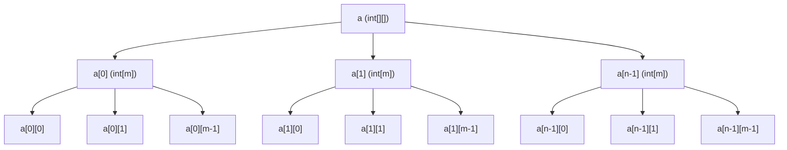
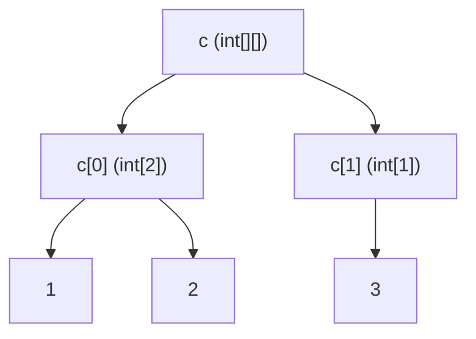

# 06 Arrays ein- und mehrdimensional
## 06 Verständnisfragen zur selbstständigen Beantwortung
### (1) Wie lassen sich die folgenden Zeilen jeweils im Speicher interpretieren. Geben Sie dafür Zeichnungen an:
```Java
int[][] a = new int[n][m];
int[][] c = {{1,2},{3}};
```
> a)

> b)


### (2) Welche Programmzeilen erzeugen die beiden folgenden Speicherkonstellationen
> ```JAVA
> int[][] a = new int[3][];
> a[0] = new int[]{1};      
> a[1] = new int[]{-1, 5};   
> a[2] = new int[]{2, 4, 6}; 

> ```JAVA
> float[][] b = new float[3][];      
> b[0] = new float[n];               // Erste Zeile mit n Elementen (n unbestimmt).
> b[1] = new float[]{3.5f, -0.3f};   
> b[2] = new float[]{0.0f, -4.03f, 2.0f};
```

## 06 Aufgabensammlung


